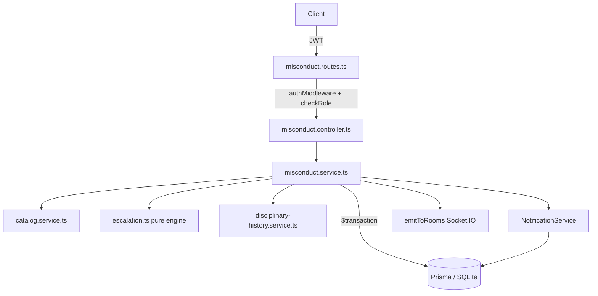
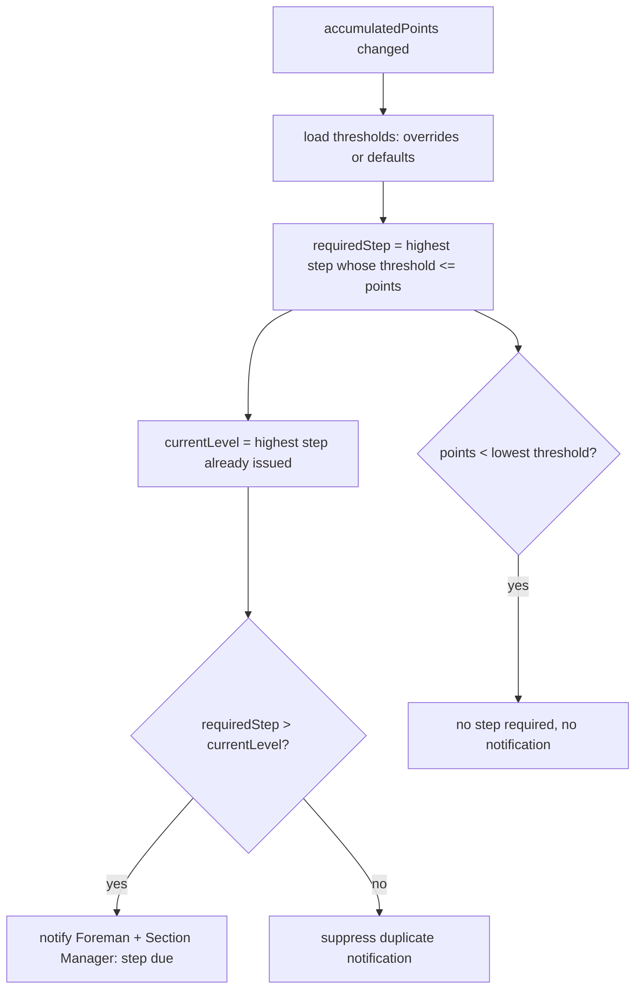

# Design Document

## Overview

The Integrated Misconduct System turns the currently disconnected disciplinary records
(pelanggaran, konseling, kartu kuning, surat peringatan) into a single, point-driven escalation
flow. It extends the existing `misconduct` module (`backend/src/misconduct/*`) rather than
introducing a new top-level module, so it inherits the established Express + TypeScript + Prisma
+ Socket.IO architecture, JWT/RBAC middleware, and the append-only `EventLog` audit trail.

The design delivers four capabilities:

1. **Violation catalog** — a managed `ViolationType` catalog carrying a defined point value
   ("variable nilai" per pelanggaran). Misconducts reference a catalog entry, and the point value
   applied at creation is **snapshotted** onto the `Misconduct` record so later catalog edits never
   mutate historical records.
2. **Point accumulation** — each operator carries `accumulatedPoints`, kept equal to the sum of the
   points of that operator's active misconducts, alongside the existing `performanceScore` and
   `totalMisconduct` counters. All updates happen inside a single Prisma `$transaction` that rolls
   back atomically on any failure.
3. **Escalation engine** — a pure evaluator that maps `accumulatedPoints` against a configurable,
   strictly increasing `EscalationThreshold` set (counseling → kartu kuning → SP1 → SP2 → SP3),
   determines the highest required step and the current escalation level (highest step already
   issued), and drives step-due notifications with duplicate suppression.
4. **Linkage + integrated view** — kartu kuning and surat peringatan link back to the contributing
   misconducts and snapshot `accumulatedPoints` at issuance, SP levels are strictly sequenced
   (1 → 2 → 3) with duplicate rejection, and a single endpoint returns the full disciplinary chain
   with role-based access.

### Design Principles

- **Snapshot over recompute.** Applied points are copied onto immutable records (Misconduct,
  KartuKuning, SuratPeringatan) so that catalog and threshold changes are non-retroactive.
- **Single source of truth for accumulation.** `accumulatedPoints` is a stored counter that is
  always reconciled to the invariant `sum(active misconduct points)` within the same transaction
  that changes the misconduct set.
- **Pure escalation logic.** The escalation decision is a pure function of
  `(accumulatedPoints, thresholds, currentLevel)`, making it deterministic and property-testable
  independent of the database and Socket.IO.
- **Extend, don't fork.** Reuse `NotificationService` (`notifyUser`/`notifyRole`), `emitToRooms`,
  `checkRole`, and the existing route/controller/service layout.

## Architecture

### Module Layout

The feature lives in the existing misconduct module plus a small catalog/escalation surface:

```
backend/src/misconduct/
  misconduct.routes.ts        # + catalog, escalation-config, history, linkage routes
  misconduct.controller.ts    # + catalog / escalation / history handlers
  misconduct.service.ts       # orchestration: transactions, notifications, sockets
  catalog.service.ts          # ViolationType CRUD + validation (new)
  escalation.ts               # pure Escalation_Engine (new, no I/O)
  escalation.config.ts        # threshold load/validate/override (new)
  disciplinary-history.service.ts  # integrated view assembly (new)
```

`escalation.ts` contains no Prisma or Socket.IO imports so it can be unit- and property-tested in
isolation. The service layer composes it with persistence and notifications.

### Request Flow



### Escalation Evaluation Flow

Escalation is re-evaluated whenever an operator's `accumulatedPoints` changes (i.e. after a
misconduct is created). The engine compares the required step against the current escalation level
(highest step already issued) to decide whether to emit a step-due notification.



### Disciplinary Step Model

Steps form a fixed ordered enumeration. The engine works on the ordinal so comparisons
("higher", "strictly increasing") are simple integer comparisons:

| Ordinal | Step                | Default Threshold |
|---------|---------------------|-------------------|
| 1       | `COUNSELING`        | 5                 |
| 2       | `KARTU_KUNING`      | 10                |
| 3       | `SP1`               | 20                |
| 4       | `SP2`               | 30                |
| 5       | `SP3`               | 40                |

Defaults are strictly increasing and each ≥ 1, satisfying Requirement 4.1. Section Manager
overrides must preserve strict monotonicity or are rejected (Requirement 4.7).

## Components and Interfaces

### 1. Catalog Service (`catalog.service.ts`)

Owns `ViolationType` lifecycle and validation.

```typescript
interface ViolationTypeInput {
  name: string;        // 1..100 chars, non-whitespace-only, unique (case-insensitive, trimmed)
  category: string;    // non-empty
  severity: string;    // non-empty
  points: number;      // integer 1..100
}

class CatalogService {
  createViolationType(input: ViolationTypeInput): Promise<ViolationType>;      // R1.1–R1.4
  updateViolationType(id: number, patch: Partial<ViolationTypeInput>): Promise<ViolationType>; // R1.4, R1.5
  deactivateViolationType(id: number): Promise<ViolationType>;                 // R1.7
  listCatalog(opts?: { includeInactive?: boolean }): Promise<ViolationType[]>; // R1.6, R1.7
}
```

- Duplicate detection normalizes the name via `name.trim().toLowerCase()` and compares against a
  stored normalized column `nameNormalized` (unique index) to make the check reliable and fast
  (R1.2).
- Validation errors carry a `field` discriminator so the API can indicate the specific invalid
  field (R1.3, R1.4).
- Updating `points` never touches existing `Misconduct.points`; only future misconducts read the
  new value (R1.5).
- `listCatalog()` excludes `isActive = false` by default (R1.7).

### 2. Misconduct Service (transactional core)

`createMisconduct` becomes transactional and catalog-driven.

```typescript
interface CreateMisconductInput {
  operatorId: number;
  createdById: number;
  violationTypeId: number;   // replaces manual points/type entry
  description: string;
  severity?: string;         // may be derived from the violation type
  evidencePhotos?: string;
}

class MisconductService {
  createMisconduct(input: CreateMisconductInput): Promise<Misconduct>; // R2, R8
}
```

Transaction body (Prisma `$transaction`, R8.3/R8.4):

1. Load the `ViolationType` by id; reject if missing (R2.2). Inactive types are allowed (R2.5).
2. Load the operator; reject with not-found if missing (R2.3).
3. Snapshot `points = violationType.points` and `violationTypeId` onto the new `Misconduct` (R2.1).
4. Recompute and set operator counters from ground truth inside the transaction:
   - `accumulatedPoints = sum(active misconduct points)` (R8.1)
   - `totalMisconduct = count(misconducts)` (R8.2)
   - `performanceScore = max(0, performanceScore - points)` (R2.7)
5. On any failure, the whole transaction rolls back (R8.4).

After commit (outside the transaction), the service fires notifications (R2.9), emits
`record:changed`, and invokes the escalation engine (R4.2).

Authorization (Foreman/Section Manager) is enforced at the route layer via `checkRole`; a rejected
role never reaches the service (R2.4).

### 3. Escalation Engine (`escalation.ts`, pure)

```typescript
type StepOrdinal = 0 | 1 | 2 | 3 | 4 | 5; // 0 = none
interface Thresholds { counseling: number; kartuKuning: number; sp1: number; sp2: number; sp3: number; }

// Highest step whose threshold <= points; 0 when below the lowest threshold.
function requiredStep(points: number, t: Thresholds): StepOrdinal;   // R4.2, R4.3

// Whether a step-due notification should fire.
function shouldNotify(points: number, t: Thresholds, currentLevel: StepOrdinal): boolean; // R4.4, R4.5

// Validate a candidate threshold config (integers >= 1, strictly increasing across steps).
function validateThresholds(raw: unknown): { ok: true; value: Thresholds } | { ok: false; error: string }; // R4.7
```

- `requiredStep` returns the maximum ordinal whose threshold is `<= points`, else `0` (R4.2/R4.3).
- `shouldNotify` returns `requiredStep(points, t) > currentLevel` (R4.4/R4.5).
- `currentLevel` is computed from persisted issuances: the highest step among issued kartu kuning
  / surat peringatan (and counseling, if configured as a tracked step) for the operator.

### 4. Escalation Config (`escalation.config.ts`)

```typescript
class EscalationConfigService {
  getActiveThresholds(): Promise<Thresholds>;              // overrides or defaults (R4.6)
  setThresholds(input: unknown): Promise<Thresholds>;      // validate, persist, or reject (R4.7)
}
```

- A single-row `EscalationConfig` table stores Section Manager overrides. When absent, defaults are
  used (R4.6).
- `setThresholds` delegates to `validateThresholds`; on failure it returns the validation error and
  leaves the previously active values unchanged (R4.7).

### 5. Kartu Kuning Issuance

```typescript
interface IssueKartuKuningInput { operatorId: number; issuedById: number; reason: string; }

createKartuKuning(input): Promise<KartuKuning>; // R5
```

- On issuance: snapshot `accumulatedPointsAtIssuance` and link the contributing active misconducts
  (all of the operator's active misconducts, whose point sum equals `accumulatedPoints`) via a
  join table (R5.1).
- If `accumulatedPoints < thresholds.kartuKuning`, record the issuance and set
  `isManualOverride = true` with the issuing user (R5.2).
- Reject if operator does not exist (R5.3).
- Reject a non-override issuance when an active kartu kuning already exists at the operator's
  current escalation level (R5.4).
- Notify operator + Section Manager (R5.5).
- List by operator returns `[]` when none (R5.6); operator self-view returns only own records (R5.7).

### 6. Surat Peringatan Issuance

```typescript
interface IssueSuratPeringatanInput { operatorId: number; issuedById: number; level: 1 | 2 | 3; reason: string; }

createSuratPeringatan(input): Promise<SuratPeringatan>; // R6
```

- `level` must be exactly 1, 2, or 3 (R6.3).
- Strict sequencing: level `N > 1` requires all levels `1..N-1` already issued, else sequencing
  error (R6.2).
- Duplicate level rejected (R6.7).
- Snapshot `accumulatedPointsAtIssuance` and link contributing active misconducts (R6.1).
- Manual override flag when `accumulatedPoints < thresholds` for level N (R6.6).
- Notify operator + Section Manager (R6.4).
- List ordered by ascending level; `[]` when none (R6.5).

### 7. Disciplinary History Service

```typescript
interface DisciplinaryHistory {
  operatorId: number;
  accumulatedPoints: number;
  currentStep: StepOrdinal;             // from Escalation_Engine
  misconducts: MisconductView[];        // chronological asc, each with linked counseling
  counselings: CounselingView[];        // chronological asc, each referencing its misconduct
  kartuKuning: KartuKuningView[];       // chronological asc, each with contributing misconduct ids
  suratPeringatan: SuratPeringatanView[]; // chronological asc, with contributing misconduct ids
}

getDisciplinaryHistory(operatorId, requester): Promise<DisciplinaryHistory>; // R7
```

- All record collections ordered chronologically ascending by `createdAt` (R7.1).
- Includes linkage references: counseling → misconduct, kartu kuning / surat peringatan →
  contributing misconducts (R7.2).
- Includes current `accumulatedPoints` and `currentStep` (R7.3).
- Not-found operator → error, no records (R7.5).
- Operator requesting another operator's history → authorization error (R7.6); operator self-view
  returns only own records (R7.4).

### Authorization Matrix

| Action                         | Foreman | Section Manager | Operator            |
|--------------------------------|:-------:|:---------------:|:-------------------:|
| Manage catalog                 |   —     |       ✓         |         —           |
| List catalog                   |   ✓     |       ✓         |         —           |
| Record misconduct              |   ✓     |       ✓         |         —           |
| Create counseling              |   ✓     |       ✓         |         —           |
| Acknowledge counseling         |   —     |       ✓         |         —           |
| Configure thresholds           |   —     |       ✓         |         —           |
| Issue kartu kuning / SP        |   ✓     |       ✓         |         —           |
| View any operator history      |   ✓     |       ✓         |   own only          |

(Super Admin bypasses all role checks via existing `checkRole` behavior.)

### API Endpoints

All under the existing misconduct router base, protected by `authMiddleware`.

| Method | Path                                   | Role(s)                      | Requirement |
|--------|----------------------------------------|------------------------------|-------------|
| POST   | `/violation-types`                     | Section Manager              | R1.1–R1.4   |
| PATCH  | `/violation-types/:id`                 | Section Manager              | R1.4, R1.5  |
| PATCH  | `/violation-types/:id/deactivate`      | Section Manager              | R1.7        |
| GET    | `/violation-types`                     | Foreman, Section Manager     | R1.6        |
| POST   | `/misconduct`                          | Foreman, Section Manager     | R2          |
| GET    | `/escalation-config`                   | Foreman, Section Manager     | R4.6        |
| PUT    | `/escalation-config`                   | Section Manager              | R4.7        |
| POST   | `/counseling`                          | Foreman, Section Manager     | R3          |
| PATCH  | `/counseling/:id/acknowledge`          | Section Manager              | R3.4, R3.5  |
| POST   | `/kartu-kuning`                        | Foreman, Section Manager     | R5          |
| GET    | `/kartu-kuning`                        | Foreman, Section Manager     | R5.6        |
| GET    | `/kartu-kuning/my`                     | Operator                     | R5.7        |
| POST   | `/surat-peringatan`                    | Foreman, Section Manager     | R6          |
| GET    | `/surat-peringatan`                    | Foreman, Section Manager     | R6.5        |
| GET    | `/disciplinary-history/:operatorId`    | Foreman, Section Manager     | R7.1–R7.3   |
| GET    | `/disciplinary-history/my`             | Operator                     | R7.4        |

## Data Models

### New and Modified Prisma Models

```prisma
// NEW: catalog of violation types with configurable point values
model ViolationType {
  id             Int      @id @default(autoincrement())
  name           String
  nameNormalized String   @unique          // trim().toLowerCase() for duplicate detection (R1.2)
  category       String
  severity       String
  points         Int                        // integer 1..100 (validated in service)
  isActive       Boolean  @default(true)
  createdAt      DateTime @default(now())
  updatedAt      DateTime @updatedAt
  misconducts    Misconduct[]
}

// MODIFIED: Operator gains accumulatedPoints counter
model Operator {
  // ...existing fields...
  accumulatedPoints Int @default(0)         // == sum(active misconduct points) (R8.1)
}

// MODIFIED: Misconduct references a ViolationType and keeps a point snapshot
model Misconduct {
  // ...existing fields (points stays as the applied snapshot)...
  violationTypeId Int?
  violationType   ViolationType? @relation(fields: [violationTypeId], references: [id])
  isActive        Boolean @default(true)    // active misconducts drive accumulation
  kartuKuningLinks   KartuKuningMisconduct[]
  suratPeringatanLinks SuratPeringatanMisconduct[]
}

// MODIFIED: KartuKuning links to contributing misconducts + snapshot + override flag
model KartuKuning {
  // ...existing fields...
  accumulatedPointsAtIssuance Int    @default(0)   // snapshot (R5.1)
  escalationLevelAtIssuance   Int    @default(0)   // ordinal used for duplicate check (R5.4)
  isManualOverride            Boolean @default(false) // R5.2
  contributingMisconducts     KartuKuningMisconduct[]
}

// MODIFIED: SuratPeringatan links to contributing misconducts + snapshot + override flag
model SuratPeringatan {
  // ...existing fields (level stays 1..3)...
  accumulatedPointsAtIssuance Int    @default(0)   // snapshot (R6.1)
  isManualOverride            Boolean @default(false) // R6.6
  contributingMisconducts     SuratPeringatanMisconduct[]
}

// NEW: join table KartuKuning <-> Misconduct (contributing violations, R5.1)
model KartuKuningMisconduct {
  id            Int         @id @default(autoincrement())
  kartuKuningId Int
  kartuKuning   KartuKuning @relation(fields: [kartuKuningId], references: [id], onDelete: Cascade)
  misconductId  Int
  misconduct    Misconduct  @relation(fields: [misconductId], references: [id], onDelete: Cascade)
  @@unique([kartuKuningId, misconductId])
}

// NEW: join table SuratPeringatan <-> Misconduct (contributing violations, R6.1)
model SuratPeringatanMisconduct {
  id                Int             @id @default(autoincrement())
  suratPeringatanId Int
  suratPeringatan   SuratPeringatan @relation(fields: [suratPeringatanId], references: [id], onDelete: Cascade)
  misconductId      Int
  misconduct        Misconduct      @relation(fields: [misconductId], references: [id], onDelete: Cascade)
  @@unique([suratPeringatanId, misconductId])
}

// NEW: single-row escalation threshold override (R4.6, R4.7)
model EscalationConfig {
  id           Int      @id @default(autoincrement())
  counseling   Int
  kartuKuning  Int
  sp1          Int
  sp2          Int
  sp3          Int
  updatedById  Int?
  updatedAt    DateTime @updatedAt
}
```

### Migration Notes

- Migrations are additive; existing `Misconduct.points` semantics are preserved (now written from
  the catalog snapshot). `violationTypeId` is nullable so historical rows remain valid.
- A one-time backfill sets `Operator.accumulatedPoints = sum(active misconduct points)` per operator
  (mirrors the existing `scripts/resync-misconduct-count.ts` approach).
- `EscalationConfig` is seeded absent, so defaults from `escalation.ts` apply until a Section Manager
  saves an override.

### Notification & Socket Integration

- Reuse `NotificationService.notifyUser` / `notifyRole` for inbox rows, and `emitToRooms` for the
  ephemeral `record:changed` signal, exactly as the current misconduct service does.
- Step-due notifications (R4.4) target `role:Foreman` and `role:Section Manager`. Duplicate
  suppression (R4.5) is enforced by the `shouldNotify` gate before any notification is written.

## Correctness Properties

*A property is a characteristic or behavior that should hold true across all valid executions of a
system — essentially, a formal statement about what the system should do. Properties serve as the
bridge between human-readable specifications and machine-verifiable correctness guarantees.*

The properties below were derived from the acceptance criteria prework and consolidated to remove
redundancy (e.g. the counter and accumulation criteria that appear in both Requirement 2 and
Requirement 8 collapse into single invariants; the KK/SP snapshot-and-link criteria collapse into
one issuance property; the escalation boundary and override cases fold into their parent
properties).

### Property 1: Valid violation types are stored faithfully

*For any* valid `ViolationTypeInput` (name 1–100 non-whitespace characters, non-empty category and
severity, integer points in 1–100), creating it stores a catalog entry whose name, category,
severity, and points equal the submitted values.

**Validates: Requirements 1.1**

### Property 2: Duplicate names are rejected and leave the catalog unchanged

*For any* existing violation type name and *any* variant of it differing only by letter case and/or
leading/trailing whitespace, submitting the variant is rejected with a duplicate-name error and the
catalog is unchanged.

**Validates: Requirements 1.2**

### Property 3: Invalid name or point values are rejected without mutation

*For any* submission whose name is empty, whitespace-only, or exceeds 100 characters, or whose
points value is non-integer, less than 1, or greater than 100, the request is rejected with an error
identifying the invalid field and the affected catalog entry is left unchanged.

**Validates: Requirements 1.3, 1.4**

### Property 4: Applied points are snapshotted and catalog updates are non-retroactive

*For any* misconduct created against a violation type (active or inactive), the misconduct's stored
points equal the violation type's points at creation time; and *for any* subsequent valid change to
that violation type's points, existing misconducts retain their original points while newly created
misconducts use the updated value.

**Validates: Requirements 1.5, 2.1, 2.5**

### Property 5: Deactivation hides from default listing but preserves references

*For any* catalog containing a deactivated violation type, the default catalog listing excludes it
while any misconduct referencing it still resolves to that violation type.

**Validates: Requirements 1.7**

### Property 6: Misconduct is rejected for a missing violation type or missing operator

*For any* misconduct submission referencing a violation type id not in the catalog, or an operator
id that does not exist, the submission is rejected with the appropriate validation/not-found error
and no misconduct record is created.

**Validates: Requirements 2.2, 2.3**

### Property 7: Performance score decreases by the applied points and floors at zero

*For any* operator and *any* created misconduct, the operator's resulting performance score equals
`max(0, previousScore - appliedPoints)`.

**Validates: Requirements 2.7**

### Property 8: Accumulated points equal the sum of active misconduct points

*For any* sequence of successful misconduct creations for an operator, after each operation the
operator's `accumulatedPoints` equals the sum of the applied points of that operator's active
misconducts.

**Validates: Requirements 2.8, 8.1**

### Property 9: Misconduct counter equals the count of misconducts

*For any* sequence of successful misconduct creations for an operator, after each operation the
operator's `totalMisconduct` equals the total number of that operator's misconduct records.

**Validates: Requirements 2.6, 8.2**

### Property 10: Misconduct creation is atomic and rolls back fully on failure

*For any* failure occurring during misconduct creation or the associated counter/score/accumulated-
points updates, no misconduct record is persisted and the operator's performance score, accumulated
points, and misconduct counter equal their values immediately before the operation.

**Validates: Requirements 8.3, 8.4**

### Property 11: Counseling requires a misconduct, is one-to-one, and inherits the operator

*For any* counseling submission, it is accepted only if it references an existing misconduct that
does not already have a counseling; when accepted the counseling's operator equals the referenced
misconduct's operator; otherwise it is rejected and no counseling is created.

**Validates: Requirements 3.1, 3.2, 3.3**

### Property 12: Acknowledgment is recorded once and is immutable thereafter

*For any* unacknowledged counseling, acknowledging it records the acknowledging user's identity and
a timestamp; and *for any* already-acknowledged counseling, a further acknowledgment is rejected and
the original acknowledging identity and timestamp are unchanged.

**Validates: Requirements 3.4, 3.5**

### Property 13: Active thresholds are always valid and invalid configs are rejected

*For any* accepted escalation threshold configuration, all five step thresholds are integers ≥ 1 and
strictly increasing across the ordered steps (counseling < kartu kuning < SP1 < SP2 < SP3); and *for
any* submitted configuration that violates these constraints, it is rejected with a validation error
and the previously active thresholds remain unchanged.

**Validates: Requirements 4.1, 4.7**

### Property 14: Required step is the highest step whose threshold is met

*For any* accumulated points value and *any* valid threshold set (default or configured override),
`requiredStep` equals the highest step whose threshold is ≤ the points, or "none" when the points
are below the lowest threshold.

**Validates: Requirements 4.2, 4.3, 4.6**

### Property 15: Step-due notification fires exactly when the required step exceeds the current level

*For any* accumulated points, threshold set, and current escalation level, a step-due notification is
signalled if and only if `requiredStep` is strictly greater than the current escalation level.

**Validates: Requirements 4.4, 4.5**

### Property 16: Issuance snapshots accumulated points and links the contributing misconducts

*For any* operator with active misconducts, issuing a kartu kuning or a surat peringatan records an
`accumulatedPointsAtIssuance` equal to the operator's current accumulated points and links exactly
the operator's active contributing misconducts whose applied points sum to that snapshot value,
together with the issuing user identity and issuance timestamp.

**Validates: Requirements 5.1, 6.1**

### Property 17: Below-threshold issuance is recorded as a manual override

*For any* operator whose accumulated points are below the threshold configured for the issued step
(kartu kuning, or surat peringatan level N), the issuance is recorded and flagged as a manual
override with the issuing user identity.

**Validates: Requirements 5.2, 6.6**

### Property 18: Issuance rejects unknown operators and non-override duplicates at the current level

*For any* issuance requested for a non-existent operator, it is rejected and no record is created;
and *for any* non-override kartu kuning issuance for an operator that already has an active kartu
kuning at their current escalation level, it is rejected and no additional record is created.

**Validates: Requirements 5.3, 5.4**

### Property 19: Surat peringatan is valid only with a legal, in-sequence, non-duplicate level

*For any* surat peringatan submission at level N, it is accepted if and only if N is exactly 1, 2, or
3, every level from 1 through N−1 has already been issued to the operator, and level N has not
already been issued; otherwise it is rejected with the corresponding validation/sequencing/duplicate
error and the operator's existing surat peringatan records are unchanged.

**Validates: Requirements 6.2, 6.3, 6.7**

### Property 20: Surat peringatan listings are ordered by ascending level

*For any* operator, the returned list of surat peringatan records is ordered by non-decreasing level.

**Validates: Requirements 6.5**

### Property 21: Record listings return only the requested operator's records

*For any* operator and *any* population of disciplinary records across multiple operators, a listing
or self-view for that operator returns exactly the records belonging to that operator (an empty list
when there are none).

**Validates: Requirements 5.6, 5.7, 7.4**

### Property 22: Disciplinary history collections are chronologically ordered

*For any* operator, each collection in the disciplinary history (misconducts, counselings, kartu
kuning, surat peringatan) is ordered from oldest to newest by creation timestamp.

**Validates: Requirements 7.1**

### Property 23: Disciplinary history includes linkage references and current escalation state

*For any* operator's disciplinary history, every counseling includes a reference to its associated
misconduct, every kartu kuning and surat peringatan includes references to its contributing
misconducts, and the response includes the operator's current accumulated points and the current
escalation step determined by the engine.

**Validates: Requirements 7.2, 7.3**

### Property 24: Disciplinary history is rejected for a non-existent operator

*For any* disciplinary history request for an operator id that does not exist, the request is
rejected with a not-found error and no disciplinary records are returned.

**Validates: Requirements 7.5**

## Error Handling

The service layer distinguishes error classes and the controller maps them to HTTP status codes
(the current controllers return 500 for all errors; this feature introduces explicit mapping):

| Error class          | Cause                                                        | HTTP | Requirements           |
|----------------------|--------------------------------------------------------------|------|------------------------|
| `ValidationError`    | Invalid name/points/level, non-increasing thresholds         | 400  | 1.3, 1.4, 4.7, 6.3     |
| `DuplicateError`     | Duplicate catalog name, duplicate counseling, duplicate SP level, duplicate KK at level | 409 | 1.2, 3.2, 5.4, 6.7 |
| `SequenceError`      | SP level out of sequence                                     | 409  | 6.2                    |
| `NotFoundError`      | Missing operator / violation type / misconduct               | 404  | 2.2, 2.3, 3.1, 5.3, 7.5 |
| `AuthorizationError` | Wrong role, or operator accessing another operator's data    | 403  | 2.4, 7.6               |
| `ConflictError`      | Re-acknowledging an already-acknowledged counseling          | 409  | 3.5                    |

Handling rules:

- **Atomicity.** All state-changing operations that touch operator counters run inside
  `prisma.$transaction`. On any thrown error the transaction rolls back so persisted state is
  unchanged (R8.4). Notifications and socket emits happen only *after* a successful commit, so a
  failed operation produces no misleading notifications.
- **Validation before writes.** Catalog and threshold validation, level checks, and existence checks
  run before any mutation, so rejected requests leave the affected records unchanged
  (R1.2, R1.3, R4.7, R6.2, R6.7).
- **Non-existent references.** Missing operator/violation type/misconduct produce `NotFoundError`
  with a message naming the missing entity.
- **Notification resilience.** `NotificationService.emit` and `emitToRooms` already swallow
  socket-not-ready errors; inbox rows persist regardless, so a transient socket failure never fails
  the request.
- **Idempotent guards.** Acknowledgment and duplicate-level checks are performed against current
  persisted state within the same transaction to avoid race-induced double writes.

## Testing Strategy

### Dual Approach

- **Unit / example tests** cover concrete scenarios, authorization at the route layer, notification
  side effects (via mocks), and latency-sensitive read endpoints.
- **Property-based tests** cover the 24 universal properties above, validating logic across a wide,
  randomized input space.

### Property-Based Testing

- **Library.** Use [`fast-check`](https://github.com/dubzzz/fast-check) with the project's test
  runner (Jest/Vitest per `backend/package.json`). Do not hand-roll generators-plus-loops; use
  `fc.assert(fc.property(...))`.
- **Iterations.** Each property test runs a minimum of 100 iterations
  (`fc.assert(..., { numRuns: 100 })`).
- **Tagging.** Each property test carries a comment tag referencing its design property:
  `// Feature: integrated-misconduct-system, Property {number}: {property_text}`.
- **Pure engine first.** Properties 13–15 (threshold validation, `requiredStep`, `shouldNotify`)
  test the pure `escalation.ts` functions with no database — fast and deterministic.
- **Data-layer properties.** Properties 4, 8, 9, 10, 16, 21 exercise the transactional service
  against a disposable test database (SQLite temp file or in-memory), with generators producing
  random operators, violation types, and misconduct sequences.
- **Generators.** Provide reusable arbitraries: valid/invalid `ViolationTypeInput`, operators,
  misconduct sequences, valid/invalid threshold configs, and SP issuance orders (including
  out-of-sequence and duplicate levels). The catalog-points generator must include inactive types
  to cover R2.5 within Property 4.
- **Rollback property.** Property 10 injects a failure inside the transaction (e.g. a mocked step
  that throws) and asserts pre-op counters are fully restored.

### Example / Integration Tests

- Route-level authorization (R2.4, R7.6): request as each role, assert 403 where disallowed.
- Notification dispatch (R2.9, R3.6, R5.5, R6.4): mock `NotificationService` and assert
  `notifyUser` / `notifyRole('Section Manager')` calls on each creation/issuance.
- Catalog read latency (R1.6): example test asserting the catalog endpoint returns the list for an
  authorized role.
- Step-due notification suppression (R4.5): integration test creating misconducts across a threshold
  boundary and asserting a single notification per newly-crossed step.

### Coverage Mapping

Every acceptance criterion is covered by at least one property or example test. Requirements that are
side-effect or latency oriented (2.9, 3.6, 4.x notification timing, 5.5, 6.4) are covered by
mock-based example tests; all logic and invariant criteria are covered by the property set above.
