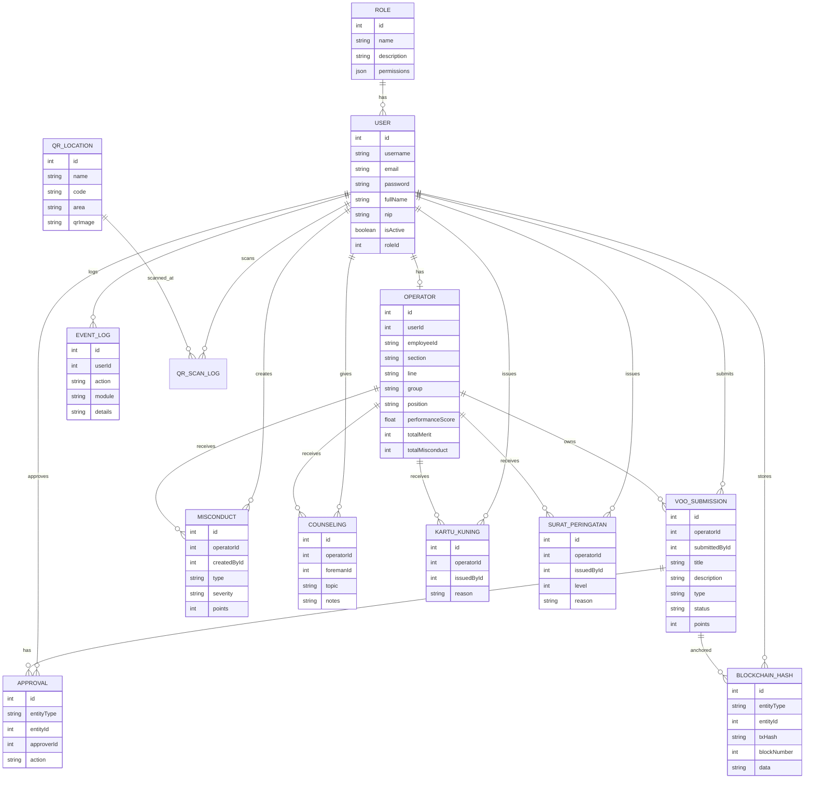
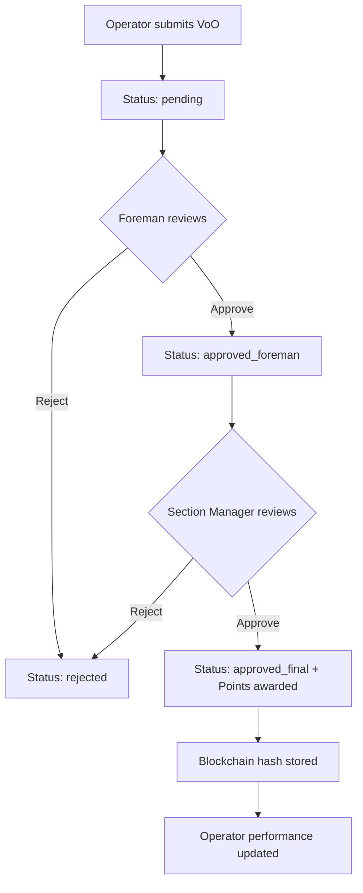
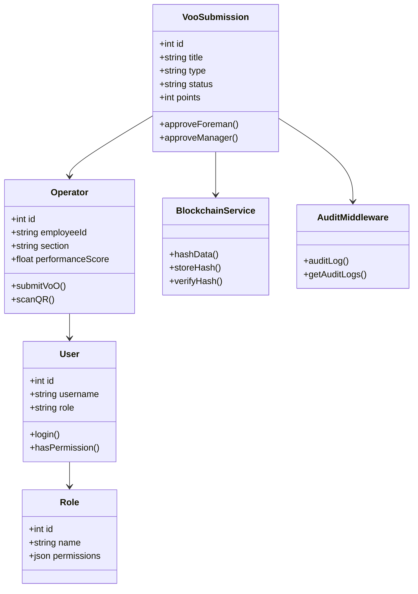

# VoO / Ide Kaizen - Performance Management System v2.0

## System Overview
Platform manajemen kinerja operator dengan fitur VoO/Ide Kaizen, monitoring misconduct, konseling, kartu kuning, surat peringatan, dan blockchain hash anchoring.

## Tech Stack
- **Backend**: Express.js + TypeScript + Prisma ORM + SQLite
- **Frontend**: Next.js 14 App Router + Tailwind CSS + Zustand
- **Blockchain**: Ethereum Ganache + Ethers.js (hash anchoring)
- **Database**: SQLite (dev) / PostgreSQL (production)

## Roles (3 Roles)
| Role | Description |
|------|-------------|
| Operator | Scan QR area, submit VoO/Ide Kaizen, upload foto, lihat status, riwayat merit |
| Foreman | Approval VoO, input misconduct/konseling/kartu kuning/SP, monitoring operator |
| Section Manager | Approval final, dashboard KPI, ranking, trend analysis, export PDF/Excel |

## Credentials (Seed Data)
| Role | Username | Password |
|------|----------|----------|
| Section Manager | section_manager | manager123 |
| Foreman | foreman01 | foreman123 |
| Foreman | foreman02 | foreman123 |
| Operator 1-5 | operator01-05 | operator123 |

## Quick Start
```bash
# Backend
cd backend
npm install
npx prisma db push --force-reset
npx tsx prisma/seed.ts
npx tsx src/index.ts

# Frontend (separate terminal)
cd frontend-next
npm install
npm run dev
```

## API Endpoints
| Method | Endpoint | Auth | Description |
|--------|----------|------|-------------|
| POST | /api/auth/login | - | Login |
| GET | /api/auth/me | Yes | Current user |
| GET | /api/operators | SM, FM | List operators |
| GET | /api/operators/ranking | SM, FM | Operator ranking |
| GET | /api/operators/my-profile | OP | My operator profile |
| POST | /api/operators/scan-qr | All | Scan QR code |
| GET | /api/voo | All | List VoO submissions |
| POST | /api/voo | OP, FM | Create VoO submission |
| GET | /api/voo/my | OP | My submissions |
| POST | /api/voo/:id/approve-foreman | FM | Foreman approval |
| POST | /api/voo/:id/approve-manager | SM | Final approval |
| POST | /api/records/misconduct | FM, SM | Create misconduct |
| GET | /api/records/misconduct | All | List misconducts |
| POST | /api/records/counseling | FM | Create counseling |
| GET | /api/records/counseling | All | List counselings |
| POST | /api/records/kartu-kuning | FM, SM | Issue Kartu Kuning |
| POST | /api/records/surat-peringatan | FM, SM | Issue Surat Peringatan |
| GET | /api/dashboard/kpi | SM | KPI Dashboard |
| GET | /api/dashboard/export/pdf | SM | Export PDF |
| GET | /api/dashboard/export/excel | SM | Export Excel |
| GET | /api/qr-locations | SM, FM | QR area locations |
| GET | /api/blockchain/status | All | Blockchain status |
| GET | /api/blockchain/hashes | SM, FM | Hash records |
| GET | /api/audit-logs | SM | Audit trail |

## ERD Diagram


## Use Case Diagram

```mermaid
graph TB
    Operator --> Login
    Operator --> ScanQR
    Operator --> SubmitVoO
    Operator --> ViewStatus
    Operator --> ViewPerformance

    Foreman --> Login
    Foreman --> ApproveVoO
    Foreman --> InputMisconduct
    Foreman --> InputCounseling
    Foreman --> IssueKartuKuning
    Foreman --> IssueSuratPeringatan
    Foreman --> MonitorOperators

    SectionManager --> Login
    SectionManager --> FinalApproval
    SectionManager --> DashboardKPI
    SectionManager --> ViewRanking
    SectionManager --> TrendAnalysis
    SectionManager --> ExportReport
    SectionManager --> ViewBlockchain
    SectionManager --> ViewAuditLogs
```


## Activity Diagram - VoO Approval Workflow


## Class Diagram

