# Diagram - Sistem Manajemen Kinerja VoO / Ide Kaizen v2.0

## 1. Diagram Use Case

### 1.1 Use Case Keseluruhan Sistem


### 1.2 Use Case per Peran


---

## 2. Flowchart

### 2.1 Alur Autentikasi


### 2.2 Alur Pengajuan & Persetujuan VoO


### 2.3 Alur Pencatatan Pelanggaran


### 2.4 Alur Pemindaian QR


---

## 3. Activity Diagram

### 3.1 Aktivitas Pengajuan VoO / Ide Kaizen


### 3.2 Aktivitas Penanganan Pelanggaran


### 3.3 Aktivitas Login & Navigasi Berdasarkan Peran


---

## 4. Sequence Diagram

### 4.1 Sekuens Login

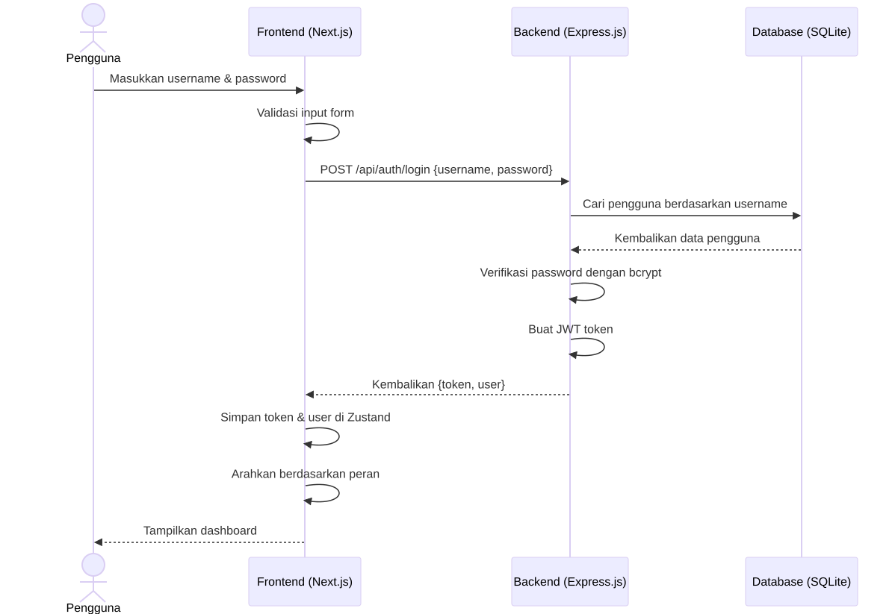

### 4.2 Sekuens Pengajuan & Persetujuan VoO

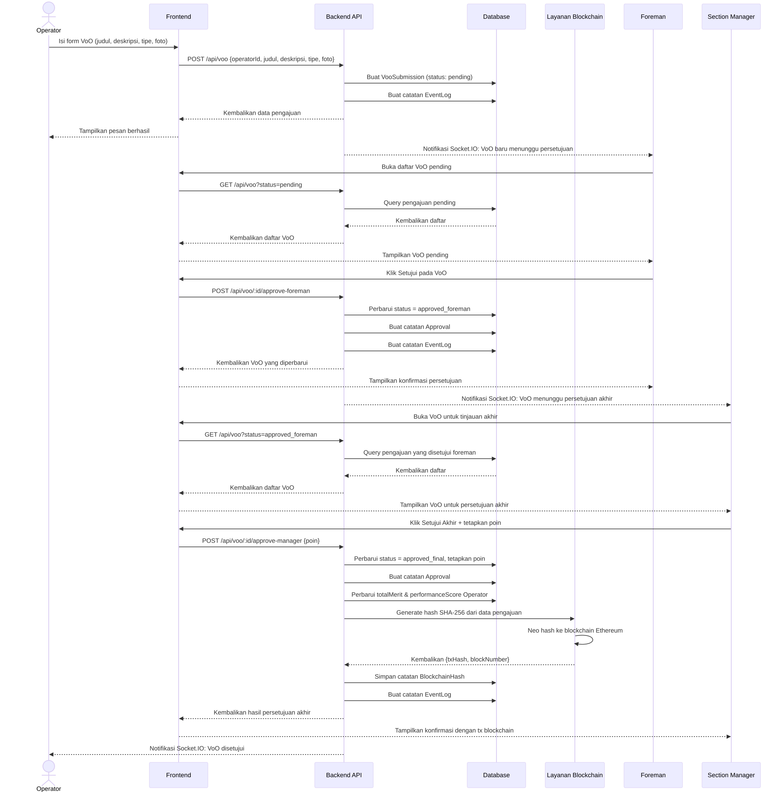

### 4.3 Sekuens Pencatatan Pelanggaran

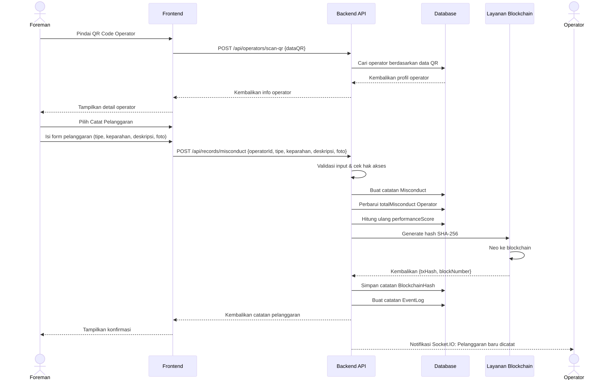

### 4.4 Sekuens Pemindaian QR Area

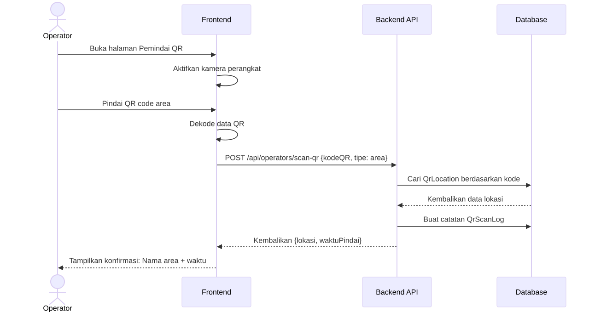

### 4.5 Sekuens Dashboard KPI & Ekspor

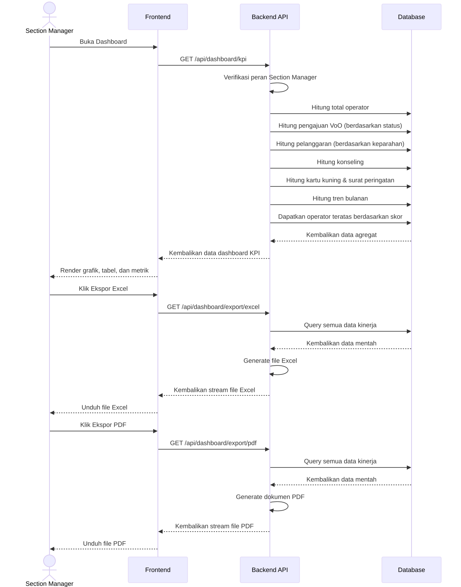

### 4.6 Sekuens Penyimpanan Hash Blockchain

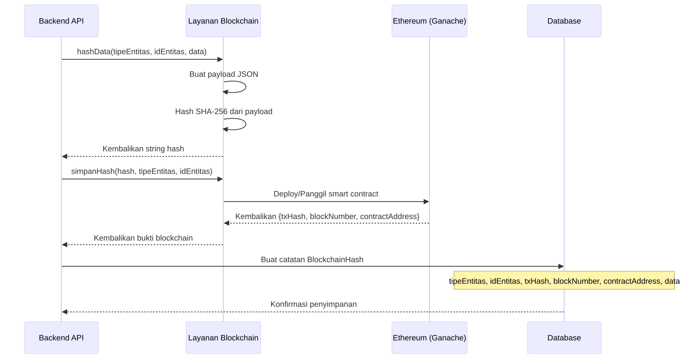

---

## 5. Diagram Tambahan

### 5.1 Gambaran Umum Arsitektur Sistem


### 5.2 Diagram Alur Data


### 5.3 Perhitungan Skor Kinerja Operator

