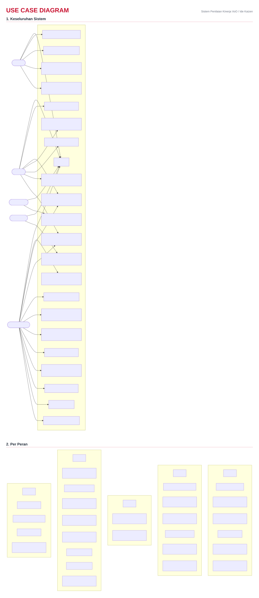
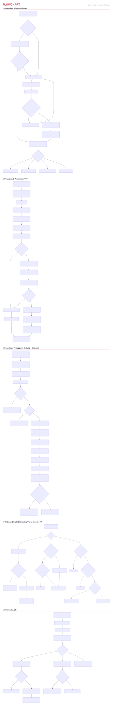
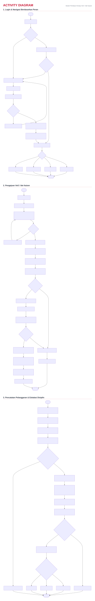
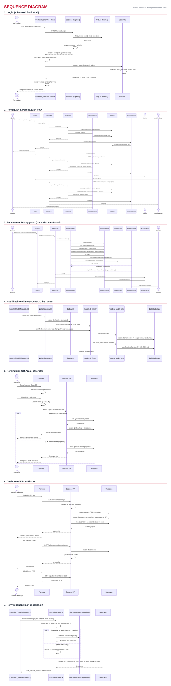
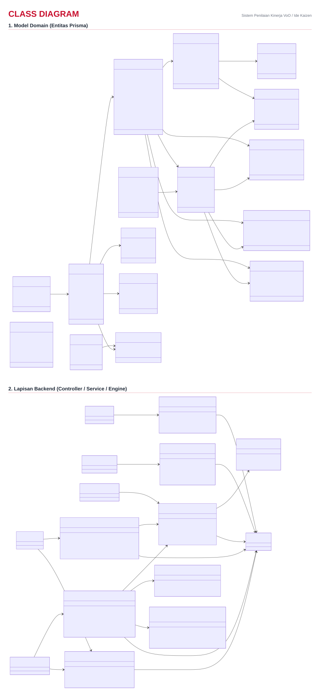
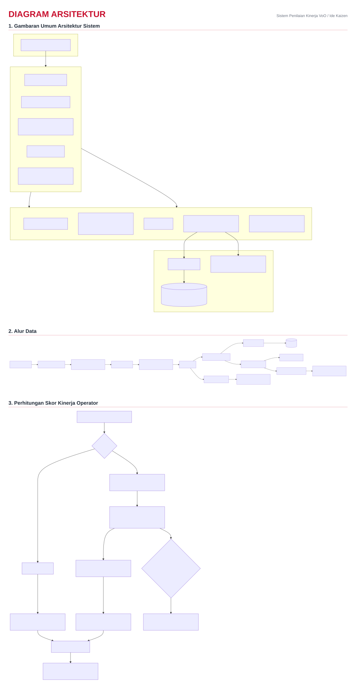

# Diagram — Sistem Penilaian Kinerja VoO / Ide Kaizen + Disiplin Terintegrasi

> Dihasilkan dari deep-dive kode pada branch `zhafran`
> (backend Express + Prisma + Socket.IO, frontend Ionic Vue 3 + Pinia).
>
> **Peran (5):** Super Admin · Section Manager · Foreman · Staff Produksi · Operator.
>
> **Struktur file:**
> - `diagrams/<kategori>.svg` — **satu file gabungan per tipe** (dipakai di dokumen ini).
> - `diagrams/individual/*.svg` — versi per-diagram terpisah (untuk kebutuhan detail).
>
> **Regenerasi:**
> 1. `node docs/generate-svgs.js` — render tiap diagram → `diagrams/individual/` (via mermaid.ink, butuh internet).
> 2. `node docs/combine-svgs.js` — gabungkan per kategori → `diagrams/<kategori>.svg`.

---

## 1. Use Case Diagram

Terpisah: [keseluruhan sistem](diagrams/individual/usecase-overall.svg) · [per peran](diagrams/individual/usecase-per-role.svg)

---

## 2. Flowchart

Terpisah: [autentikasi](diagrams/individual/flowchart-auth.svg) · [VoO](diagrams/individual/flowchart-voo.svg) · [pelanggaran](diagrams/individual/flowchart-misconduct.svg) · [tindakan disiplin](diagrams/individual/flowchart-disciplinary.svg) · [pemindaian QR](diagrams/individual/flowchart-qr-scan.svg)

---

## 3. Activity Diagram

Terpisah: [login](diagrams/individual/activity-login.svg) · [pengajuan VoO](diagrams/individual/activity-voo.svg) · [pelanggaran & eskalasi](diagrams/individual/activity-misconduct.svg)

---

## 4. Sequence Diagram

Terpisah: [login](diagrams/individual/seq-login.svg) · [persetujuan VoO](diagrams/individual/seq-voo-approval.svg) · [pelanggaran](diagrams/individual/seq-misconduct.svg) · [notifikasi realtime](diagrams/individual/seq-realtime-notification.svg) · [pemindaian QR](diagrams/individual/seq-qr-scan.svg) · [dashboard KPI](diagrams/individual/seq-dashboard.svg) · [hash blockchain](diagrams/individual/seq-blockchain.svg)

---

## 5. Class Diagram

Terpisah: [model domain](diagrams/individual/class-domain.svg) · [lapisan backend](diagrams/individual/class-backend.svg)

---

## 6. Diagram Arsitektur (Tambahan)

Terpisah: [gambaran umum](diagrams/individual/arch-overview.svg) · [alur data](diagrams/individual/arch-data-flow.svg) · [skor kinerja](diagrams/individual/arch-performance-score.svg)
